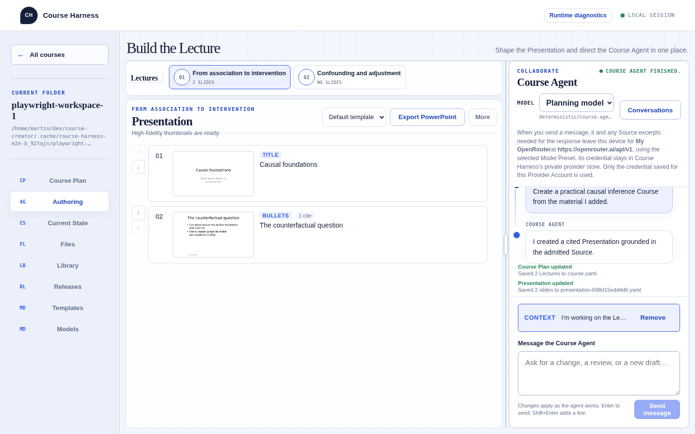
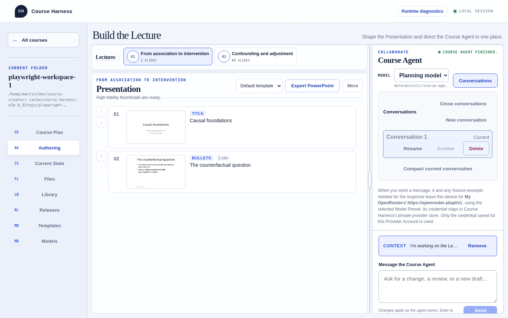
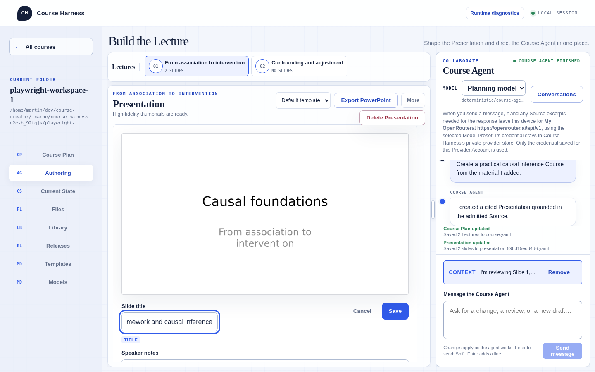

# Course Workspace UX audit

Date: 2026-09-23. Outcome: [redesign PRD](../specs/course-workspace-ux-redesign.md).

## Method and boundaries

Reviewed the owner's eight screenshots, repository domain/architecture documentation, React markup, and CSS. Used the Playwright CLI to operate the production React build served by Python at `127.0.0.1:18765` in an isolated temporary Course Workspace. The browser used pinned Chromium from the repository's Nix shell. Main viewport: 1440 × 900; additional inspection: 1024 × 768.

The local smoke server uses a deterministic FunctionModel, fake provider validation, and an isolated native-picker substitute. Actions exercised real UI and local persistence, but do not establish real-provider output quality, real native-picker usability, remote discovery quality, or PDF conversion performance. No real credentials were submitted and no personal Course was modified.

This is a heuristic/product audit by an agent, not a user study. Distinguish observed behavior, source-supported explanation, and design inference below. Browser automation passing demonstrates functional paths; it does not establish good usability.

## Walkthrough record

| Task | Observed result |
| --- | --- |
| Launch; New course | Restricted Launcher worked. After selection, eight navigation destinations and a Course essentials/Lecture list form appeared. The form did not foreground starting with papers. |
| Open Library; upload checked-in chapter_causal.md | Resource appeared with Ready and Indexed labels, plus Preview, Reprocess, Use as course material, and Delete. |
| Use as course material | Added Admitted and Unadmit; Delete disappeared from that row. Find in sources appeared below Remote discovery. |
| Preview Resource; close; search “counterfactual” | Preview opened and closed. Search returned one match at Line 3. Snapshot exposed literal `<mark>` text in the snippet; this should be checked visually before treating it as a separately confirmed rendering defect. |
| Models; save fake account and preset; return to Authoring | Required a separate main view. The test validator accepted the deterministic values. |
| Ask agent to create a Course from material | Real tools wrote a Course Plan with two Lectures and a cited Presentation with two Slides through the deterministic model. |
| Inspect authoring layout | At 1440 × 900, agent panel measured 374 × 762 px; transcript 372 × 159 px; composer 372 × 272 px, with a context chip and result activity visible. |
| Open Conversations | Management region expanded inside the already constrained agent header, with Rename, Archive, Delete, and Compact current conversation controls. |
| Open More | Revealed only Delete Presentation. A normal click left `window.getSelection().toString()` empty. Text-selection behavior from the owner's screenshot was not reproduced. |
| Select Slide; edit title; save | Title input measured 233 px inside a 695.25 px header. A long title saved and appeared in the later overview; the editing control showed only a small part at once. |
| Current State; create Course Revision | View showed 3 changed files, line counts, file-level revert controls, structural validity, and a Workspace Drift section. Named Revision creation was exercised. |
| Releases; select a Lecture; name; validate | Selecting the Lecture did not select its Presentation artifact. Validation reported “No findings. This selection is ready to publish.” Publication itself was not performed in the exploratory walkthrough. |
| Templates; import python-pptx-test.pptx | Imported profile exposed a table of concrete layouts, placeholder dropdowns, confidence labels, and mapping explanations. |
| Files | Read-only inventory of course.yaml, sources.yaml, Presentation directory and YAML. Utility is mostly inspection of storage, not everyday Course work. |
| Resize Authoring to 1024 × 768 | Existing interface correctly switched to Presentation/Course Agent tabs, but retained the approximately 248 px global navigation rail. Both facts matter: a responsive mode already exists, yet much width remains reserved for secondary navigation. |

Exploratory screenshots were captured under `output/playwright/`: `authoring-current.png`, `conversations-current.png`, `library-current.png`, `slide-edit-current.png`, `history-current.png`, `templates-current.png`, and `authoring-1024.png`. Selected evidence is retained with this report in [ux-audit-images](ux-audit-images/). These are current-build evidence, not redesign mockups.

## Findings and design implications

| Priority | Finding and evidence | Consequence | Proposed response |
| --- | --- | --- | --- |
| P0 | Eight equal destinations mix creation, storage, settings, and publication. Observed navigation; App.tsx sections. | Author must understand implementation areas before starting. | Persistent shell organized around Course Plan, Sources, and actual Lectures; move utilities to contextual surfaces. |
| P0 | Material-led start is not the landing flow. Observed New course form. | The target author is asked to supply structure before receiving help from their papers. | Start with add/discover/reuse material and a conversation about teaching intent. |
| P0 | Only 159 px of transcript height in the observed desktop state. DOM measurement and screenshot. | Conversation feels like a cramped accessory despite being the main interaction. | Compact header/composer; dedicated readable conversation; focus modes. |
| P0 | Library membership and processing appear as adjacent success pills. User screenshots and reproduced upload/admission. | Ready, Indexed, and Admitted look interchangeable. | Separate processing availability from Course membership, with distinct labels and actions. |
| P1 | Search and discovery follow the potentially long Resource list. LibraryView.tsx and browser. | Central research tasks become progressively harder to reach. | Top-positioned search with explicit This course / Library / Discover scopes. |
| P1 | Conversations are management cards in the chat header. Reproduced. | Opening history squeezes the conversation and emphasizes record maintenance. | Familiar navigator list; row menu for infrequent actions. |
| P1 | Agent response body is a plain paragraph (`
{parts.body}
`). AgentPanel.tsx; owner screenshot shows literal Markdown. | Structured replies lose readability. | Safe streaming Markdown renderer with controlled links and code treatment. |
| P1 | Slide title gets 233 px despite a 695.25 px header. Reproduced. | Author edits a long title through a narrow horizontal viewport. | Full-width growing field; independent action toolbar. |
| P1 | Current State leads with file/line counts and low-level terminology. Reproduced. | Recovery value is obscured by implementation vocabulary. | History with domain summaries, meaningful Revisions, and explicit recovery consequences. |
| P1 | Release validation can be successful with a Lecture selected and no Presentation selected. Reproduced; may be valid domain behavior. | Author may mistakenly believe a PowerPoint is included. | Show exact Artifact manifest and explicit no-files state; distinguish export from Release. |
| P1 | Templates expose every mapping and slot immediately. Reproduced import. | Choosing an appearance feels like configuring a parser. | Gallery for selection; guided visual review for problematic mappings; advanced editing retained. |
| P1 | Toolbar profile select is capped at 190 px. styles.css; owner's long-name screenshot. | Machine-like filenames dominate and truncate. | Human display name separate from filename/identity; gallery selection. |
| P2 | More contains a single destructive action. DOM is `details > summary` plus button. | Adds ambiguity and a click without useful grouping. | Separated trash control with label and confirmation. |
| P2 | Buttons lack consistent spacing/hierarchy across Resource rows. Owner screenshot; Library screenshot. | Processing, destructive, and primary actions compete. | Shared toolbar primitives; default read action; secondary details and menus. |
| P2 | Multiple decorative labels, boilerplate headings, and permanent status text. Observed across surfaces. | Content competes with commentary about the interface itself. | Copy budget: labels, consequences, and recovery only. |
| P2 | CH badge and duplicated MD navigation abbreviations do not explain Course work. Observed. | Identity and iconography add visual decoding. | Simple text wordmark; recognizable icon+label navigation. |

P0 means foundational redesign work; P1 means required workflow/component correction; P2 means supporting polish. These are UX priorities, not security or data-loss severity ratings.

## Evidence images

### Authoring at 1440 × 900

### Conversation management consumes the chat surface

### Slide title editing

## What to preserve

The product already has valuable mechanisms: persistent Conversations, explicit Course Source admission, Citation-linked evidence, a resizable authoring split, a narrow-screen Presentation/Agent switcher, deterministic persistence, meaningful Revisions, drift reconciliation, pinned Template Profiles, and immutable Releases. The redesign should make these usable without flattening their semantics or removing safeguards.

The isolated app's functional ability to upload, search, create, edit, and validate was evident. The central deficiency is presentation and task organization; the audit does not justify rewriting the domain backend wholesale.

## Limits and follow-up verification

- The owner's screenshot of text selection on More remains unconfirmed. A normal click did not reproduce it; a browser extension indicator is visible in the owner's image, but its causality is unknown. Do not claim CSS alone caused it.
- Long UUID-like template names and very large Resource lists were evaluated from supplied screenshots and code, not recreated at full scale in the isolated Workspace.
- Remote discovery was inspected, but no external query was submitted during the walkthrough. Native PDF download/processing and real model behavior were not evaluated manually.
- Initial browser console included an unbound `/api/workspace` 409 and a favicon 404. Later transient API error logging was also present; successful visible results should not be used to infer an entirely clean console. These are not established causes of the UX findings.
- Full implementation should retain meaningful functional regression coverage and add redesign-specific assertions from the PRD. A screenshot or passing automated accessibility scan alone cannot validate information architecture.

## Reference patterns

Official descriptions of [Claude Artifacts](https://www.anthropic.com/news/artifacts), [Claude Projects](https://www.anthropic.com/news/projects), and [ChatGPT Projects](https://openai.com/academy/projects/) support the patterns of adjacent conversational output and grouped material/chat context. They informed the proposal; no exhaustive competitor UI benchmark was performed.

## Baseline regression checks

Ran the repository checks inside the pinned Nix shell during this documentation/design task. Ruff lint and formatting, ty, frontend lint/typechecking/build, and all 9 Playwright journeys passed. The Python suite reported 379 passed and 1 skipped. Frontend lint emitted 23 existing CSS specificity warnings; no application files were changed to address them. These results establish a working baseline, not validation of the proposed redesign.
