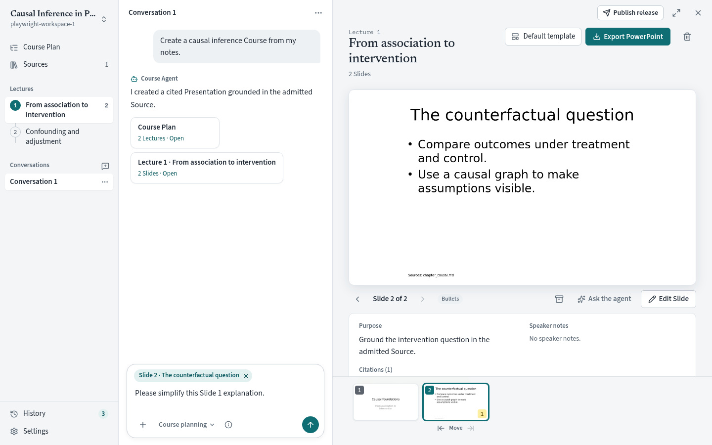
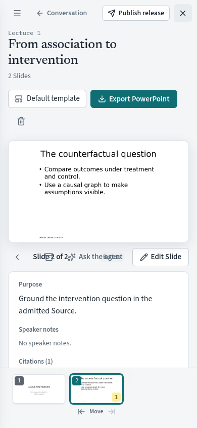

# Course Workspace UX: implementation follow-up

Date: 2026-09-24. Reviewed revision: `36994df`.

Scope: bounded design/usability review of the implemented workspace, including the owner's accepted refinements and subsequent feature commits. This is not an exhaustive code or backend review. No application changes were made during this review.

## Recommendation

Keep the new design. It solves the main organizational and visual problems identified in the [original audit](course-workspace-ux-audit.md). The next round should protect unfinished work and improve return-to-work behavior; a second broad redesign would have little value now.

The [PRD](../specs/course-workspace-ux-redesign.md) and design artifacts were already committed in `d8d1dc6`. Claude's implementation-status section accurately records several partial features. The simplified canvas toggle, original-file source reader, and “Compact conversation” wording reflect subsequent owner feedback and should remain. They are not failures to follow the original proposal.

## What is working

- Material-led first use: uploading a Markdown Resource from the start surface included it in the Course without visiting a separate administration view.
- Model setup opened in a dialog and returned to the conversation. The deterministic test model created a Course Plan and cited Presentation through the actual local tools.
- The Course Plan, Lecture navigator, persistent conversation, and linked results make the product's structure understandable.
- Chat now has usable reading space. At 1440 × 900, the observed transcript region was approximately 684 px high, compared with 159 px in the original audit. Content and transient state differ between measurements, so this is an illustrative comparison rather than a controlled benchmark.
- Sources has scoped search at the top and a restrained item/action layout. The three-green-pill problem is gone.
- Slide editing has a spacious multiline title field. The separated Presentation deletion action and direct PowerPoint export are clearer.
- The visual system is coherent: bundled typography, restrained surfaces, actual icons, and one main accent. Preserve it.

## Confirmed issues to address next

Priority here reflects effects on the author, not severity of the underlying code. The three draft issues were reproduced against the isolated app without changing personal Courses.

### 1. High: leaving a Slide editor silently discards unsaved work

**Reproduction:** open a Lecture → Edit Slide → replace the title with `UNSAVED REVIEW CHECK` → click Sources → return to the Lecture. The editor has closed and the original title remains. No save/discard prompt appeared and the draft was not restored.

**Why it matters:** inspecting material is a normal part of writing a Slide. The continuous workspace invites this navigation, so losing work here contradicts its central promise.

**Relevant code:** [App.tsx](../../frontend/src/App.tsx), `openCanvas` and `closeCanvas`; [LectureCanvas.tsx](../../frontend/src/canvas/LectureCanvas.tsx), `SlideEditor` local `values` and `dirty` state. At the reviewed revision these begin around lines 346 and 1176 respectively. Navigation replaces the canvas without consulting the dirty editor.

**Suggested behavior:** retain a draft keyed by Workspace, Presentation, and Slide when changing canvas destinations. Keep explicit Save. If retention is not implemented immediately, require Save / Discard / Stay before leaving dirty content. Cover navigation, Close canvas, switching Courses, and page unload. Settings can remain openable if it does not unmount the editor.

**Acceptance:** edit a title and notes, inspect Sources and History, return, and recover the exact draft. Save persists it; explicit Discard removes it. A background agent update must not silently overwrite the draft or be overwritten by it.

### 2. High: a restored Conversation draft can target the wrong Slide

**Reproduction:** in Conversation 1, select Slide 1 and type `Please simplify this Slide 1 explanation.` → New conversation → select Slide 2 → reopen Conversation 1. The text returns, but the context chip reads `Slide 2 · The counterfactual question`.

**Why it matters:** a realistic prompt such as “Simplify this” could now ask the agent to change the wrong Slide. The chip makes the mismatch inspectable, but users should not have to detect a silent retargeting themselves. This review did not send the mismatched request or claim that an incorrect edit occurred.

**Relevant code:** [useCourseAgent.ts](../../frontend/src/useCourseAgent.ts), `draftsRef` stores only strings (around line 185), and `restoreDraftFor` restores only prompt text (around line 544). Context is shared state outside that draft map. [App.tsx](../../frontend/src/App.tsx) updates context when canvas focus changes with an empty prompt.

**Suggested behavior:** treat a composer draft as one object containing text, selected context, and attachment references. Restore it atomically per Conversation. A new Conversation starts with an explicit default context policy. Keep the existing “use selected context” affordance for deliberate retargeting. Audit attachments as part of that fix; cross-Conversation attachment behavior was not separately exercised in this review.

**Acceptance:** a Slide 1 draft keeps its Slide 1 context across new/saved Conversation switches while the canvas visits other Slides. Changing context requires an explicit action. Two drafts must not inherit each other's attachments.

### 3. Medium: contextual agent shortcuts replace an existing message

**Reproduction:** with the draft above still in the composer, click Ask the agent beneath the Slide. The text is replaced by `Improve this Slide: ` without confirmation or an undo affordance.

**Relevant code:** [App.tsx](../../frontend/src/App.tsx), `askAgent` calls `agent.setPrompt(request)` unconditionally (around line 367). The Slide action is one caller of this shared helper.

**Suggested behavior:** if the composer contains text, focus it and offer an explicit suggestion to insert or replace; alternatively append the proposed instruction with a visible undo. Only prefill directly when empty. Avoid a confirmation dialog for every ordinary shortcut by presenting the suggestion next to the existing draft.

**Acceptance:** Ask the agent, Ask for a review, and Draft Slides preserve an existing unsent message unless the author explicitly chooses replacement. Each action still works in one click when the draft is empty.

### 4. Medium: mobile Slide controls overlap

**Reproduction:** view a two-Slide Presentation at 390 × 844, then Show canvas. In the selected-Slide toolbar, the counter/navigation, layout label, Archive, and Ask the agent overlap. This is visible in the stable screenshot below; it is not the temporary navigator animation captured immediately after resize.

**Relevant code:** [lecture.css](../../frontend/src/styles/lecture.css), `.stage-bar`, `.stage-nav`, `.stage-actions`, and narrow-screen rules; [LectureCanvas.tsx](../../frontend/src/canvas/LectureCanvas.tsx), selected-Slide toolbar.

**Suggested layout:** row one contains Previous / Slide N of M / Next. Row two contains Ask the agent and Edit Slide, with Archive in a labeled actions menu. Hide or relocate the secondary layout label at narrow widths. Use available container width so a narrow desktop split also behaves correctly.

**Acceptance:** at 390 px and 200% zoom, controls never overlap and all remain keyboard/touch accessible. Check the same toolbar with long translated labels or larger text. A DOM accessibility scan alone will not catch this collision.

## Remaining PRD work: priorities rather than another redesign

| Next improvement | Current evidence | Recommendation |
| --- | --- | --- |
| Reliable edit conflict handling | PRD explicitly defers comparison/merge. The editor preserves local values while open, but this is not equivalent to checking for stale saves. | Include with draft protection. Compare the edited revision or fields at save time; return a useful conflict choice rather than last-write-wins. Concurrency was not independently reproduced here. |
| Meaningful Conversation names | The completed test exchange still appeared as Conversation 1. The original PRD proposed a title derived locally from the first prompt. | Use a shortened first prompt as the default, keeping Rename. This would make the improved navigator useful once many Conversations accumulate. |
| Resume where you stopped | PRD lists missing reload restoration, and drafts live in an in-memory map. | Persist draft/context and last canvas/Slide in private app state, keyed by Workspace and Conversation. Check referenced IDs still exist. Prioritize before more visual polish. |
| Real template previews | PRD acknowledges abstract template cards. | Worth doing when authors regularly switch templates. Render a representative title/content example so selection communicates actual appearance. |
| Sources batch actions | PRD lists no batch selection. | Useful for paper-heavy Courses: include/remove selected items with clear per-item results. Keep dependency protections. |
| Resizable conversation | PRD records responsive width but no user resizing. | Optional. The current desktop proportions are already much better. Add only after draft fixes and if actual use exposes a recurring width problem. |
| Durable linked results | PRD records transcript result links as session-only. | Preserve them with messages or reconstruct from stable entity references, with graceful handling of deleted content. |

Avoid treating every proposal in the initial PRD as mandatory polish. Its purpose was to establish the interaction model. The present implementation achieves that model well enough to learn from real use.

## Efficient next implementation round

1. **Protect work:** Slide draft retention/navigation guard, Conversation draft bundles, and non-destructive agent shortcut prefills. Add focused regression journeys for the reproductions above.
2. **Fix narrow controls:** responsive selected-Slide toolbar, with screenshots at 390 px and a narrow desktop canvas.
3. **Improve returning sessions:** meaningful Conversation titles and reload restoration.

Then have someone unfamiliar with the project add material, make a short Course, revise a Slide, inspect its evidence, and export. Observe where they hesitate without coaching. That small exercise is likely to produce more useful design input than a further aesthetic overhaul.

## Review method and limits

Used the existing Playwright CLI workflow and the production bundle at 1440 × 900 and 390 × 844, plus targeted source inspection. The isolated smoke server used the repository's deterministic FunctionModel and provider validators; uploaded the checked-in `chapter_causal.md` fixture. No real provider calls or personal Course edits were required. The desktop screenshot was captured while native Slide previews were updating; that transient state is not a defect finding.

The review covers the current design, not every later feature. Real model capability detection, image attachment lifecycle, all Source formats, discovery services, every release edge case, and a full keyboard audit remain outside this bounded pass. Earlier comments about long names and template visuals should not be mistaken for fresh testing of every variation.

Baseline validation: `bun run test:e2e` passed all 10 journeys, including its frontend lint, typecheck, and production build prerequisites. The manual checks above expose interaction gaps beyond that passing suite. No new application tests or fixes were added in this review; the reproductions are acceptance criteria for the next implementation round.
