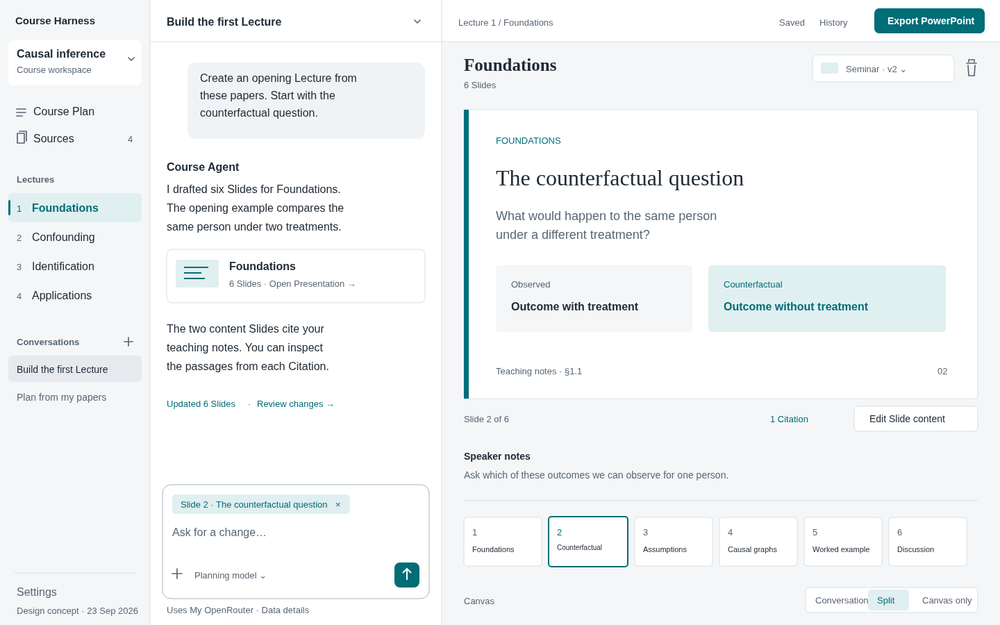

# Course Workspace UX redesign

Status: first implementation round complete (see [section 12](#12-implementation-status-round-1)). Earlier status: proposed design.

Date: 2026-09-23. Companion: [browser audit](../research/course-workspace-ux-audit.md).

Follow-up: [2026-09-24 implementation review](../research/course-workspace-ux-followup.md) records confirmed draft-protection gaps, a narrow-screen toolbar issue, and a prioritized next round after the owner's accepted refinements.

## 1. Product direction

Course Harness should feel like a place where you build a Course with an agent. Open your material, discuss what to teach, inspect the Course Plan, work on a Presentation, and follow a Citation back to its Evidence without losing your conversation.

The main design change is to replace eight equally prominent destinations with one persistent working shell. The shell has a course navigator, a conversation, and a canvas. The canvas changes with the work. Short setup tasks open in dialogs; longer reading and editing tasks occupy the canvas. History and exports are available from the course toolbar.

The primary entry journey is **building a Course from papers and existing material**, as selected by the project owner. Starting from a topic and revising existing Courses remain supported. There is no mandatory sequence of stages.

This is a product proposal based on a browser walkthrough, source inspection, and the owner's feedback. The personas are working hypotheses, not interview findings. The proposed usability targets have not yet been measured.

### Desired experience

“I added my papers, chose which ones the Course should use, and asked for a plan. Now I can discuss a Lecture while seeing and editing its Slides. I can tell what the agent changed, check its evidence, and get my PowerPoint.”

### Goals

- Make the first useful action obvious for someone arriving with material.
- Keep conversation, selected content, and supporting evidence connected.
- Make direct editing as available as agent assistance.
- Explain inclusion, processing, saving, recovery, and publication through visible consequences.
- Preserve source provenance, recoverable work, and editable PowerPoint output.
- Make routine work comfortable on a university laptop.

### Out of scope

Application implementation in this design round; a new agent orchestration architecture; multi-user collaboration; an LMS; arbitrary filesystem access; a PowerPoint-compatible freeform drawing editor; automatic scientific fact verification; rebranding the product. Keep “Course Harness” as a text wordmark and remove the CH badge from the main workspace chrome.

## 2. People and jobs

| Working persona | Situation and job | What the interface must help them answer |
| --- | --- | --- |
| Material-led Course Author — primary | Has papers, notes, an existing syllabus, or Presentation files. Needs a coherent teachable sequence. Familiar with chat assistants; little interest in Git or indexing. | What have I added? What can the agent actually use? How do I turn these into a Course? |
| Topic-led Course Author | Knows the audience and topic, but needs material and structure. | Can I start with my idea and discover useful Resources while planning? |
| Returning Course Author | Revises a Lecture for the next session or prepares a deliverable. | Where did I stop? What changed? Can I recover an earlier version and export the right material? |

An uploaded syllabus starts as a Resource. The author and agent use it to create or revise the authoritative Course Plan; uploading it must not silently replace the Course Plan. Similarly, uploading an existing PowerPoint makes it available as material; do not imply editable Slide import unless that capability is implemented.

## 3. Information architecture

### Persistent shell

1. **Course navigator:** course identity and switcher; Course Plan; Sources; ordered Lectures; Conversations; Settings at the bottom.
2. **Conversation:** active Conversation, messages, contextual agent activity, approvals, and composer. It stays mounted while the canvas changes.
3. **Canvas:** start surface, Course Plan, Sources, Presentation, source reader, or History. One primary document at a time, with a back trail where appropriate.
4. **Course toolbar:** save state, History, and Export. The current Course is always identifiable.

Course Plan and Sources are two stable workspace destinations, followed by actual Lecture titles. “Authoring” disappears: choosing a Lecture opens its Presentation in the canvas. There is no global row of abbreviations such as CP, AG, or MD.

The course switcher returns to the restricted Workspace Launcher. Opening another Course explicitly unbinds the current Course before binding the selected one. Changing Conversations within a Course never changes the Course's canonical state.

### Where existing functionality goes

| Current view/control | Proposed home | Reason |
| --- | --- | --- |
| Course Plan | Canvas; permanent navigator item | The Course's structure stays easy to find. |
| Authoring | A Lecture's canvas plus persistent conversation | Planning and making Slides become one continuous activity. |
| Current State | History from course toolbar; exception banner for external changes | Recovery and change review become recognizable tasks. |
| Files | Settings → Workspace details → Course files | Preserve inspectability as an advanced utility. |
| Library / Resources | Sources canvas: This course, Library, Discover | Keep Course inclusion, reuse, and discovery adjacent. |
| Releases | Export dialog → Course Release; previous Releases in History | Deliverables start from intent to export or publish. |
| Templates | Presentation toolbar → Template gallery; Settings for management | Choose by appearance; configure mappings when needed. |
| Models | Composer model chooser → Add model dialog; Settings for management | Setup returns directly to the interrupted task. |
| Conversations CRUD panel | Navigator conversation list | Switching chats must not consume the transcript area. |
| Runtime diagnostics | Settings → Diagnostics | Surface actionable failures in context; keep routine internals quiet. |

“Sources” is the workspace entry label. Inside it, **This course** contains Sources; **Library** contains reusable Resources; **Discover** contains Candidates until explicitly saved. These distinctions remain in the domain and APIs. Interface labels explain actions without making the author learn “admission.”

## 4. Main flow: papers to Presentation

```text
Workspace Launcher
  → New course → native folder chooser → bound workspace
  → Add material or Discover papers
  → Inspect Resources → choose Add to course
  → State audience and teaching aim → ask for Course Plan
  → Review Course Plan alongside conversation
  → Open a Lecture → ask for / directly edit a Presentation
  → Inspect Citations and source passages as needed
  → Export PowerPoint
  → Optionally publish a named Course Release
```

### A. Create or reopen

The Launcher offers New course, Open course, and recognizable recent Courses. Only New/Open/recent selection and relevant diagnostics operate while unbound. Use the native folder picker; never introduce a browser path entry or general filesystem browser.

After folder selection, show the Sources-led start surface. Allow the temporary name “Untitled course”; request a useful title as the Course Plan forms. Do not require a Lecture list before the agent can help. A Course Workspace may contain research before it has a Course Plan.

On return, restore the active Conversation, canvas, selected Lecture/Slide, panel widths, and reading position from private application state. Verify saved IDs still exist; fall back to Course Plan with a short explanation if an item was removed. Show pending approvals and unresolved changes prominently.

### B. Add and discover material

The start canvas presents a large drop area with **Add files**, and adjacent **Discover papers** and **Choose from Library** actions. The conversation offers one useful prompt: “What should this Course help people learn?” These are alternate starting points, not steps in a wizard.

Adding files here explicitly means adding material to this Course. Show that destination before the action. Internally, register Resources, process them, and create Source admissions when ready, with individual progress and failures. Report partial success; never show a Source as usable before processing succeeds. Preserve current model-download consent before a required PDF model download. Closing the prompt leaves a recoverable pending item, not a falsely completed upload.

Adding from the Library or discovery is explicit per item or selected batch. “Save to Library” retains a Resource without making it a Source. “Add to course” performs the deliberate inclusion operation. A Candidate preview remains transient until one of those actions is chosen. Do not silently give the agent every Resource in the global Library.

### C. Turn material into a plan

After at least one Source is usable, offer **Draft Course Plan**. It places an editable request in the composer referencing selected material and asks for audience and teaching aim if missing. The author can send it, change it, or continue researching. It never sends automatically.

If no Model Preset is available, open Add model from the composer. Preserve the prompt and source selection. Saving a verified preset returns focus to the composer; cancellation keeps the draft intact. Upload, discovery, browsing, and direct editing remain usable without an agent model.

When the agent creates a Course Plan, open it on the canvas and show a linked result in the Conversation. The author can edit audience, goals, outcomes, and Lecture order there. Keep a visible “Saved” or “Unsaved changes” indication. Agent proposals respect the existing guided/autonomous approval mode; do not introduce mandatory approval for every normal edit.

### D. Build and refine a Lecture

Select a Lecture in the navigator. If it has no Presentation, show its title and **Create Presentation** plus an editable suggested request. This is a normal state: a planned Lecture need not have Slides.

When Slides exist, show a useful preview area and compact thumbnail filmstrip. Select a Slide to edit it or discuss it. The composer shows a compact context chip such as “Slide 3 · Back-door criterion.” Clicking a Citation opens the exact Evidence beside the work, with a return action to the Slide. This must not change the conversation's editing target from the Slide to the Source without an explicit choice.

Changes appear as concise linked results: “Updated 3 Slides” → inspect changed Slides. Technical tool activity is expandable. Stop remains accessible during generation; after stopping, explain which valid changes remain saved. A stopped run does not imply rollback.

### E. Deliver

Export PowerPoint is directly available for the selected Presentation. A Course-level Export control opens choices for the selected Presentation or a Course Release. Explain once: a PowerPoint export is a file from the current work; a Course Release preserves a named, validated publication with pinned inputs.

Release preparation displays selected Lectures and actual included Artifacts, validates them, links findings to affected content, and asks for a name. Generate a slug with a preview and optional edit. A Lecture-only publication is allowed if supported, but must explicitly say “No Presentation files included.” Never imply selection of a Lecture also selected its PowerPoint when it did not.

Publishing creates the immutable local Course Release; it does not imply uploading to a website. Provide clear downloads and pin details afterward. Structural errors block publication. Quality warnings offer a correction or an explicit, recorded Waiver, preserving the existing policy.

## 5. Layout and wireframes



[Open the scalable concept](course-workspace-concept.svg). This is a design mockup with illustrative content, not an implemented screen. It uses available system fonts for portability; the proposed font families below remain an implementation choice.

### First use, after binding a Workspace

```text
┌──────────────────────┬────────────────────────────────────────────────────┐
│ Untitled course    ▾ │                                              Export│
│                      │                                                    │
│ Course Plan          │  Start with your material                           │
│ Sources              │  ┌──────────────────────────────────────────────┐  │
│                      │  │ Drop papers, notes, or presentation files     │  │
│ Lectures             │  │                 [ Add files ]                │  │
│                      │  └──────────────────────────────────────────────┘  │
│                      │  [ Discover papers ]  [ Choose from Library ]      │
│ Conversations    +   │                                                    │
│                      │  What should this Course help people learn?        │
│                      │  ┌──────────────────────────────────────────────┐  │
│                      │  │ Write your teaching aim…                      │  │
│ Settings             │  │ + Add material        Choose model       ↑   │  │
└──────────────────────┴──┴──────────────────────────────────────────────┴──┘
```

Before a working document is open, use one generous central area with the composer below it. Do not show an empty Presentation pane. Once the author opens material or the agent produces content, the conversation and canvas split appears.

### Ongoing Course work — default desktop composition

```text
┌────────────────────┬──────────────────────────┬─────────────────────────────────────┐
│ Causal inference ▾ │ Course Plan discussion  ▾ │ Causal inference   Saved  History   │
│                    │                          │                          [ Export ] │
│ Course Plan        │ You                      ├─────────────────────────────────────┤
│ Sources         4  │ Build four Lectures from │ Course Plan                         │
│                    │ these papers.            │ Audience: Applied researchers [Edit]│
│ Lectures           │                          │                                     │
│ 1 Foundations      │ Course Agent             │ 1  Foundations                      │
│ 2 Confounding      │ Here is a proposed       │    Interventions and assumptions    │
│ 3 Identification   │ teaching sequence…       │                         [ Open ]    │
│ 4 Applications     │                          │ 2  Confounding                      │
│                    │ [ Course Plan · Open ]   │    Recognize confounders            │
│ Conversations   +  │                          │                         [ Open ]    │
│ Course Plan…       │                          │ …                                   │
│ Examples…          │                          │                                     │
│                    │ ┌──────────────────────┐ │                                     │
│                    │ │ Course Plan       ×  │ │                                     │
│                    │ │ Ask for a change…    │ │                                     │
│ Settings           │ │ +   Planning model ↑ │ │                                     │
└────────────────────┴─┴──────────────────────┴─┴─────────────────────────────────────┘
```

At 1440 px, target roughly 216 px navigator, 420 px conversation, and the remaining 804 px canvas, including dividers. The conversation can resize between 360 and 560 px while the canvas keeps at least 560 px. Collapse the navigator before compressing the working panes below those limits. Offer Conversation only, Split, and Canvas only layout controls; these control layout, not workflow stages.

At 1024 px use a collapsed navigator or navigation drawer. Offer Conversation/Canvas switching if a useful split no longer fits. At 390 px show one surface with a compact Course/Conversation/Canvas switcher and full-height dialogs. Preserve composer draft and scroll position across switches. Never stack two full-height workspaces vertically or require horizontal page scrolling.

### Sources canvas

```text
Sources                                       [ Add files ]
[ This course · 4 ]   [ Library ]   [ Discover ]
┌─────────────────────────────────────────────────────────┐
│ Search source content…                               ⌕  │
└─────────────────────────────────────────────────────────┘
□  Introducing the Model Context Protocol         Included
   Anthropic · PDF · 2.3 MB                    ✓ Searchable
□  Causal inference foundations                  Included
   Teaching notes · Markdown                  ✓ Searchable
□  Identification paper                          Included
   arXiv · PDF                               ◌ Processing

Select a title to read. Selection checkboxes support batch actions.
```

Use real titles where metadata provides them, with the filename/URL available in details. A row's title is a keyboard-focusable preview action; row whitespace may activate it, but checkbox and action clicks must not also open the preview. Do not nest buttons inside a button.

In This course, search queries source content and results show passage, location, and title; title filtering is an explicitly labeled alternative. In Library, search initially filters Resource metadata unless global full-text search is implemented. In Discover, the query goes to the displayed discovery services. Keep scopes explicit and retain each scope's query. Do not silently send a local query to remote services.

## 6. Component and behavior requirements

### Conversation and composer

- Render safe Markdown: paragraphs, headings, lists, links, code, and tables. Disable raw HTML; handle streaming partial Markdown without replacing the entire transcript or losing selection.
- Assistant messages use the available reading width without nested bordered cards or timeline decoration. User messages have a restrained tint. Use 16 px text and approximately 1.5 line height.
- Idle header: Conversation title and actions only. Place model selection in the composer. Show activity status when running, stopped, failed, or awaiting approval; remove permanent “ready” decoration.
- Composer grows from two lines to approximately six before scrolling. Keep one compact context row and one action row. At 1440 × 900, an idle split conversation with a two-line draft and one context chip must leave at least 400 px for transcript reading.
- Context is explicit: Course Plan, Lecture, Slide, or selected Evidence. The chip can be inspected or removed. Freeze context with the draft once typing starts; if the canvas selection changes, offer “Use selected Slide” rather than silently retargeting the request. Store context on sent messages.
- Course Sources remain available for grounding; a context chip is a focus hint, not exclusive access to one Source. Uploaded attachments must go through the explicit Course inclusion flow.
- Enter sends; Shift+Enter adds a line, respecting IME composition. Show Stop in the send position during a run. Approvals stay reachable without scrolling to the bottom.
- Keep a brief provider destination disclosure near the model control, expandable to endpoint, data sent, and credential storage details. Present full relevant disclosure during setup and when destination changes. Preserve explicit existing consent for template metadata and PDF model downloads; reducing clutter must not conceal data transmission.
- Scrolling up stops automatic transcript scrolling. Show “Jump to latest” when new content arrives. A running agent must not steal focus or overwrite a direct editing draft.

### Conversation navigation

Conversations appear as a compact list in the navigator, grouped by recency when useful. Show a descriptive title derived locally from the first prompt, editable inline; use “New conversation” for an unsent draft. Do not add a model call just to name it.

Each row opens a Conversation. A plus starts a new one. A row menu holds Rename, Archive, and Delete. Menus become visible on keyboard focus as well as hover; provide a touch-accessible trigger. “Archived conversations” is a filter, not a badge on every normal row. Search/filter titles once the list grows.

New drafts do not accumulate as saved Conversations before the first message. Switching restores that Conversation's transcript and composer draft. Pending approvals are marked. Preserve existing restrictions on destructive operations during pending approvals. Context Compaction becomes “Summarize earlier context” in the Conversation menu, with the existing editable preview and preserved transcript. It is not a primary chat navigation action.

### Resource state and actions

Keep processing and Course membership independent; they are not three successive green achievements.

| Underlying condition | Visible presentation | Useful action |
| --- | --- | --- |
| Resource registered, processing not begun | File type icon, “Waiting to process” | Process; remove if safe |
| Processing or indexing underway | Spinner and concrete stage; no invented percentage | Inspect progress; retry after failure |
| Readable but search index unavailable | “Readable · Search unavailable” with warning icon | Read; retry indexing |
| Searchable Resource, not a Source here | Normal row, “In Library”; quiet searchable metadata | Add to course |
| Searchable Source | “Included” membership marker; searchable metadata | Read; remove from course in detail |
| Processing failed | Error icon, brief reason in row | Retry; inspect details |
| New remote version found | “Update available” with version detail | Compare, then explicitly use new version |

The title/preview is the normal primary action. Reprocess, Refresh, and index repair belong in Resource details or an overflow menu. Global index regeneration belongs in Settings/Diagnostics and appears in context only when needed. A labeled trash icon is separated from constructive actions. In This course it means **Remove from course**; global deletion is labeled **Delete from Library** in the Library scope/detail. Do not show a destructive action that the backend cannot safely perform.

Before removal or deletion, explain affected Citations and Courses to the extent known. Preserve pinned Source Versions and immutable Release references. If dependency information is unavailable, keep the existing backend protection and show its reason. Never implement silent cascading deletion to simplify the row.

### Presentation editing

Use a canvas and compact thumbnail filmstrip, with clear selected state and a Slides overview option. A vertical filmstrip may be used in Canvas only mode; use a horizontal one when it would consume needed canvas width. Lecture navigation stays in the course navigator instead of another permanently expanded list.

Clicking a Slide selects it. An explicit Edit control opens a spacious editor in the canvas; it does not navigate away. Title and body fields use full available width. The title grows to multiple lines, and its full text is readable at 200% zoom. Move Save and Cancel to a consistent editor toolbar rather than competing with the title field. Keep explicit Save for the first implementation and protect unsaved edits when leaving. Do not accidentally save on blur.

Keep speaker notes and Citations close to the selected Slide using labeled sections. Preview text selection for agent context must be explicit and must not masquerade as direct editing. The interface can offer “Ask about selection.” Direct editing remains structured content editing; do not imply arbitrary PowerPoint shape manipulation.

Distinguish approximate preview, rendering, rendered preview, stale preview, and failed rendering. A missing native renderer permits a labeled approximation and export if otherwise supported. Previews and toolbar must identify the pinned Template Profile version used for output.

Presentation toolbar: a visual Template button, Export PowerPoint, and a separated trash icon with accessible name “Delete Presentation.” Clicking trash opens a concise confirmation naming the Lecture and recovery consequence. Do not delete the Lecture when deleting its Presentation. Slide archive remains available separately and reversible.

### Templates

Template choice opens a gallery dialog with thumbnails, short editable display names, and version information. Show the selected profile and **Import template** together. Keep long filenames in secondary details; never force raw IDs or UUID-like names into the toolbar.

On import, ask for a display name with a sensible filename-derived suggestion. For machine-generated names, suggest “Imported template” and invite renaming. Preserve unique stable identity and versioning independently of the display name. Duplicates receive a readable suffix, not exposed identifiers.

Import has three short phases: name/import, inspect preview, apply. Surface mapping problems as “3 layouts need review.” Open one mapping at a time with an actual layout preview and visible slot highlights. Advanced controls retain concrete layout and placeholder selection. Small visual choices use thumbnail radio cards; larger placeholder lists can remain accessible comboboxes. Replacing every dropdown with a wall of options would increase clutter.

“Apply to Course” pins a specific profile version. Editing a reusable profile creates a new version without silently repinning existing Courses or Releases. Keep calibration, mapping validation, and optional AI assistance with its existing disclosure and consent. Gallery thumbnails are a proposed capability; handle pending or failed generation explicitly.

### History, saving, and recovery

The toolbar says **Saved**, **Saving…**, **Unsaved changes**, or **Couldn't save — Retry** according to actual persistence. “Saved” never means “released” or necessarily “captured in a Course Revision.”

History opens a wide drawer or canvas view with **Current changes**, **Course Revisions**, and **Course Releases**. Current changes describe affected domain objects when a reliable comparison is possible: “Course Plan changed,” “Lecture 2: 3 Slides updated,” or “2 Sources added.” Provide file details as a secondary disclosure. Never invent semantic summaries from insufficient file metadata.

**Create Course Revision** saves a meaningful milestone with an editable suggested summary. Normal edits remain saved as Current State even without a new Revision. Do not create a visible Revision for every keystroke or every tool call. Per-object revert requires backend support; until then label file-level operations with their full affected scope. Restore previews what will change, protects current work, and requires confirmation. An active agent run and a restore must not race.

External changes produce a persistent, actionable banner: “Course files changed outside the app — Review changes.” Review explains affected material, validates it, and offers the existing reconciliation process. Do not silently accept drift or hide it in Settings. The precise operations blocked during unresolved drift must follow the existing server contract.

### Files and settings

Course files remains a read-only inventory of the selected Workspace, reachable in Workspace details. Show the explicit Workspace identity there. Do not add arbitrary paths or a general filesystem browser. Models, Provider Accounts, templates, diagnostics, and storage information live in one Settings dialog with sections. Short contextual model setup is the same form opened from the composer, not a second implementation.

## 7. Visual direction and interaction system

Use a quiet academic workbench: neutral surfaces, readable content, a single teal accent, and useful teaching sequence numbering. The distinctive feature is a **connected Lecture navigator**: the selected Lecture, its Slides, relevant Sources, and recent agent changes stay visibly related. This conveys Course structure without decorative timelines or progress stages.

Proposed tokens, subject to screenshot and contrast validation:

| Role | Value |
| --- | --- |
| Main surface | `#FFFFFF` |
| Navigator / canvas surround | `#F4F6F8` |
| Primary text | `#202B36` |
| Secondary text | `#596674` |
| Action / focus | `#006D77` |
| Dividers | `#D9E0E5` |

Use semantic warning/error/success colors only for their states, always with icons and text. Use a 4 px spacing base; 8–12 px between controls; 16–24 px within surfaces. Interactive controls target 40 px height, at least 44 px on touch layouts. Use a consistent outline icon family with text for primary navigation. Active state is a subtle filled row; keyboard focus is a distinct visible ring.

Typography proposal: Source Sans 3 for interface and transcript, restrained Source Serif 4 for Course and Lecture document headings, monospace only for actual code or file identifiers. Bundle fonts locally if adopted; no third-party font request in normal app use. Interface headings are 20–24 px; body and transcript 16 px; secondary metadata 13–14 px. The current oversized serif page headings and uppercase section labels do not belong on every working surface.

Buttons follow one hierarchy: primary filled for the main action, secondary neutral for alternatives, icon/quiet actions for local utilities. Align by shared toolbar layout and height. Avoid per-view margin patches. Keep destructive actions spatially distinct and red on interaction/confirmation, not visually equal to every other action.

Use motion only to communicate opening a surface or progress, with reduced-motion support. Remove the graph-paper background, repeated nested card borders, decorative eyebrows, and idle green pills. The initial idea of three permanently visible panes is deliberately relaxed for first use and smaller screens: otherwise the redesign would reproduce the same density problem.

### Copy rules and examples

Each sentence must label a thing, explain a consequence, or help recover. Remove text that only restates the heading. Do not remove meaningful provider disclosures or error recovery to achieve visual simplicity.

| Current | Proposed |
| --- | --- |
| Give the course a clear shape. | Start with your material |
| Shape the Presentation and direct the Course Agent in one place. | Remove; the layout demonstrates this. |
| Registered resources | Library |
| Admitted / Unadmit | Included / Remove from course |
| Findings at the margin | Issues to review |
| Choose the published spine | Choose Lectures and files |
| Saved 2 slides to presentation-…yaml | Updated 2 Slides · Review |
| Current State is up to date. | Saved, only when persistence is confirmed |

Use neutral Course Author-facing language and “you.” Domain nouns remain available where their distinction matters; technical storage vocabulary belongs in details.

## 8. Accessibility and failure behavior

- All actions are keyboard reachable, with visible focus and accessible names. Icon-only controls get tooltips and labels. Color never carries state alone.
- Dialogs name their purpose, manage focus, close with Escape when safe, and return focus to their trigger. Unsaved data prompts before dismissal. Model setup does not create nested focus traps.
- Menus use menu behavior; selects/comboboxes use selection behavior. Use tested accessible primitives in implementation; native selects remain acceptable for advanced forms.
- The navigator identifies the current item; resizers support keyboard controls and a reset. Drag reordering has Move earlier/later alternatives.
- Announce errors and completion concisely without rereading every streamed token. Keep error text adjacent to the failed operation and preserve entered values.
- Opening Sources, a model dialog, or History cannot clear a draft. Restoring a Course, removing material, or deleting a Presentation must show the specific affected scope before confirmation.
- Processing errors are per item; one bad PDF must not block reading ready Sources. Discovery has loading, empty, partial-provider-failure, and retry states.
- Source retrieval and model request failures show their actual destinations and retry choices. Never silently switch provider or broaden source scope on failure.
- Agent edits and direct edits use conflict detection. If content changed while an editor was open, retain the draft and ask the author to compare/reload; do not overwrite either version silently.
- Test 1440 × 900, 1280 × 800, 1024 × 768, 390 × 844, and 200% zoom. Content and controls remain reachable with long Course names, filenames, model names, and template names.

## 9. Acceptance scenarios

These are redesign requirements, not claims about the current build.

| ID | Given / action | Required observable result |
| --- | --- | --- |
| UX-01 | New Workspace, no model; add two supported files | Material flow is immediately visible; independent progress; no model setup required. |
| UX-02 | Upload succeeds for one file and fails for another | Ready Source is usable; failed item shows reason and retry; no false “all ready.” |
| UX-03 | Search in This course, then switch to Discover | Scope is explicit; local query is not sent remotely until a discovery search; queries survive switching. |
| UX-04 | Add a Candidate to Library, then to Course | Membership visibly changes only after explicit inclusion; failure leaves truthful state. |
| UX-05 | Compose with no model; add a verified preset | Dialog returns to the same prompt, context, and Sources; author still chooses Send. |
| UX-06 | Agent produces Course Plan | Plan opens beside readable conversation; user can edit/reorder Lectures without a different app section. |
| UX-07 | Select Slide; type; inspect a Citation; return | Draft and editing target survive; exact Evidence location is shown; selected Slide is restored. |
| UX-08 | Edit a 100-character Slide title | Full value is readable through wrapping; actions do not squeeze the field; save persists; cancel discards only that edit. |
| UX-09 | Open/switch Conversations | Transcript space is not consumed by CRUD cards; switching does not change Course state; draft is preserved. |
| UX-10 | Stop a run with partial valid edits | Generation stops; UI accurately states retained changes and links to review. |
| UX-11 | Use History after several edits | Author can identify changed Course content, create a Revision, inspect restore consequences, and recover without Git commands. |
| UX-12 | External files change | Actionable review banner; no silent overwrite; server drift rules preserved. |
| UX-13 | Import long-named template; select it | Readable name and preview; toolbar does not expand/overflow; pinned version shown. |
| UX-14 | Delete Presentation from toolbar | Accessible explicit control; confirmation identifies Lecture; Lecture remains after Presentation deletion. |
| UX-15 | Export Presentation | Download matches selected Presentation and pinned template; no Release required. |
| UX-16 | Prepare Release with Lecture but no Artifact | Review explicitly says no Presentation files; structural blockers and waivable warnings remain distinct. |
| UX-17 | Publish Release and edit Course afterward | Release keeps original pinned inputs and Artifacts; mutable Course can continue. |
| UX-18 | Keyboard and narrow-screen journey | All primary tasks complete without hover, dragging, clipped controls, or loss of draft/context. |

### Usability validation before full polish

Test a clickable prototype with 3–5 people unfamiliar with the repository. Ask them to add provided material, draft a Course Plan, edit a Slide title, inspect a Citation, recover a change, and export. Do not explain the navigation first.

Proposed targets: at least 4 of 5 find the material entry point within 30 seconds; at least 4 of 5 correctly explain whether a Resource is included in the Course; all participants recover a saved edit and distinguish export from Release after using the relevant surface. Report completion, wrong turns, and facilitator help separately from model/processing latency. These are formative design targets, not statistically conclusive measurements or production telemetry requirements.

## 10. Implementation boundaries and order

Keep Python as the HTTP boundary and host of the production React bundle. Preserve one explicit bound Course Workspace, human-readable canonical state, and private caches/credentials/transcripts outside it. Do not implement appearance changes by bypassing validation or persistence APIs.

Relevant existing decisions: [Resource versus Source](../adr/0002-separate-readable-resources-from-course-sources.md), [versioned Template Profiles](../adr/0003-map-arbitrary-powerpoint-templates-with-versioned-profiles.md), [meaningful Course Revisions](../adr/0006-version-every-course-workspace-with-git.md), [immutable Releases](../adr/0009-represent-course-releases-with-git-tags-and-manifests.md), [release linting](../adr/0011-treat-citation-coverage-as-conservative-release-linting.md), and [explicit Workspace selection](../adr/0012-start-unbound-and-open-workspaces-explicitly.md). This proposal changes their presentation rather than superseding them.

One documentation inconsistency to resolve separately: CONTEXT.md describes hidden derived runtime data in a Course Workspace, while AGENTS.md and README place runtime caches outside it. This design follows the architecture invariant in AGENTS.md; do not use the stale glossary wording to move caches into Courses.

| Slice | End-to-end deliverable | Principal work / dependency |
| --- | --- | --- |
| 1 — Shell and conversation | Open Course, chat, switch Conversation, open Course Plan, add model in place | App.tsx layout and state ownership; AgentPanel.tsx presentation; ProviderSetup.tsx reusable dialog; shared controls and CSS. |
| 2 — Material-led start | Add/discover/read/include/search Sources, then request a Course Plan | LibraryView.tsx split into scoped browser and reader; preserve Resource/Source contracts; upload-to-inclusion orchestration and partial failures. |
| 3 — Presentation work | Open Lecture, edit Slides, inspect Citations, choose template, export | PresentationView.tsx canvas/editor and context targeting; TemplatesView.tsx gallery/import; long-name handling. |
| 4 — Recovery and publication | Review Current State, create/restore Revision, publish Course Release | CurrentStateView.tsx semantic presentation, ReleasesView.tsx export flow; keep drift and validation protections. |
| 5 — Hardening | Complete primary journey at all target widths and with keyboard | Error/empty/loading states; safe Markdown; visual review; existing smoke/a11y regression gates. |

Each slice must leave a usable app. Migrate retained capabilities into their new homes before removing the old view. Avoid layering a third visual override system on the existing stylesheet: build scoped layout/components and remove replaced rules as the surfaces move.

Likely additional work beyond styling: persistent per-Conversation drafts; structured focus/context references instead of a concatenated sentence; reliable domain change summaries; template gallery images; coordinated registration/processing/admission; concurrency-safe direct edit handling. Verify available API support before promising these in a frontend-only ticket. If entity-level revert lacks support, retain accurately labeled file-level recovery until implemented.

### Proposed defaults for the next round

Use conversation on the left and canvas on the right; retain layout focus modes. Keep explicit Save for direct edits initially. Prefer source inclusion from the Course add-material flow, with a separate Library-only option. Keep the product name and use no new logo. Retain guided/autonomous agent behavior. These choices are reviewable defaults, not unresolved blockers.

## 11. Inspiration and its limits

Borrow the continuity of a Conversation and its adjacent output from [Claude Artifacts](https://www.anthropic.com/news/artifacts), and the organization of related chats and material from [Claude Projects](https://www.anthropic.com/news/projects) and [ChatGPT Projects](https://openai.com/academy/projects/). These official descriptions support the interaction patterns, not a claim that their current interfaces were exhaustively audited.

The Course-specific adaptation is the visible Lecture sequence, explicit Source inclusion, Citation inspection, recoverable Course state, and distinction between mutable exports and immutable Releases. Gemini, Cowork, and Claude Design are owner-supplied directional references; their interfaces were not independently evaluated in this audit. A generic chat clone would not provide enough structure for Course work.

## 12. Implementation status (round 1)

Implemented on 2026-09-23 as a full replacement of the previous React surfaces and stylesheet.

**Built as specified**

- Persistent shell: navigator (course switcher, Course Plan, Sources, numbered Lecture sequence, Conversations, History, Settings), a conversation that stays mounted, and a canvas that is either split beside the conversation or expanded (closing it gives the conversation the full width). Owner feedback replaced the separate Conversation only mode, which duplicated Close; choosing a Conversation leaves the expanded canvas. The navigator becomes a drawer below 1180 px; below 900 px one pane shows at a time.
- Material-led start: when no Course Plan exists, the conversation shows the start surface (drop zone, Discover papers, Choose from Library, included Sources, "Write the plan yourself"). Files added there are uploaded and included in the Course, with per-file progress, failures, retry, and the PDF-model consent flow as a recoverable pending item.
- Conversation: safe Markdown (no raw HTML), compact header, growing composer, model chooser in the composer, Add model dialog that returns to the draft, collapsible provider disclosure, Stop in the send position, jump to latest, context chips that follow the open Course Plan/Lecture/Slide while the draft is empty and offer "Use …" once typing has started, per-Conversation drafts, linked results ("Course Plan · Open", "Lecture 1 · 2 Slides · Open"), and an accurate note after stopping.
- Conversation navigation in the navigator with row menus (Rename, Archive/Restore, Delete with confirmation), archived filter, and "Summarize earlier context" in the Conversation menu.
- Course Plan canvas with in-place Lecture rename, move earlier/later, add, and remove, plus an Edit details dialog. New endpoints back this: `PATCH /api/course`, `POST /api/course/lectures`, `DELETE /api/course/lectures/{id}` (refused for a Lecture with a Presentation or the last Lecture).
- Owner feedback after the first pass: the Slide stage arrows now switch Slides (also with ←/→) and reordering moved into the Slide actions menu; the Source reader switches between extracted text and the original file inline; "Summarize earlier context" is named "Compact conversation", the term used by other agent harnesses.
- Sources canvas with This course / Library / Discover tabs, search at the top of each scope, distinct processing vs membership states, title-as-read action, overflow menus for secondary actions, a separated trash action with scope-specific meaning, and a Source reader that highlights cited lines (the "evidence" highlighter colour is reserved for this).
- Lecture canvas with stage preview, horizontal filmstrip, Citation count markers, full-width Slide editor for every layout field, explicit Save, evidence chips that open the reader with "Back to Slides" (the selected Slide is restored), template gallery dialog, Export PowerPoint, and a separated Delete Presentation with a confirmation that names the Lecture.
- History canvas (Current changes in domain language, Course Revisions, Releases with immutable detail), a drift banner, and a Release canvas that includes a Lecture's PowerPoint by default and warns explicitly when no files are included.
- Settings dialog with Models, Templates (mapping review surfaces low-confidence layouts first), Workspace (identity and read-only Course files), and Diagnostics.

**Deferred or partial**

- The conversation width is responsive (`clamp(360px, 36%, 520px)`) but not user-resizable yet.
- Template gallery cards use an abstract slide mock rather than rendered thumbnails.
- Current changes map files to domain objects (Course Plan, Slides for Lecture N, Course Sources); revert remains file-level and says so.
- Linked results in the transcript are kept for the session only; they are not persisted with the transcript.
- The open canvas and selected Slide are not restored after a full reload.
- The Slide editor does not reload over an open draft when the agent changes the Presentation, but there is no compare/merge prompt yet.
- Drift is detected when the Course loads, after agent runs, and when History opens, not continuously.
- Sources has no batch selection yet.
- The usability study in section 9 has not been run.
